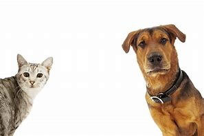
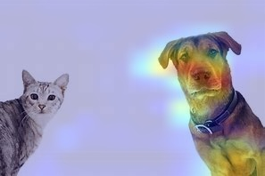

# Grad-CAM Visualization Project

This project implements Grad-CAM (Gradient-weighted Class Activation Mapping) using TensorFlow and Keras with the pre-trained VGG16 model to visualize class-specific areas of an image that the model focuses on during classification.




## Project Structure
```
├── gradcam.py           # Contains the Grad-CAM implementation
├── main.py              # Main app entry point
├── setup.py             # Your script to build the entire app
├── LICENCE.py           # The Licence that this code is distributed under.
├── predict_api.py       # API for handling prediction requests
├── POC.ipynb            # Proof of concept notebook
├── view/                # Folder containing UI interface for the app
├── artifacts/           # Folder to store input images and output Grad-CAM visualizations
│   ├── cat_dog.jpeg     # Sample input image
│   └── gradcam_output.jpg  # Generated Grad-CAM image
└── README.md            # This readme file
```

## Requirements
The project relies on the following libraries:

- There is a requirements.txt file that have all you need

- `tensorflow`
- `opencv-python`
- `numpy`
- `matplotlib`

To install the dependencies, you can run:

You can use the setup.py file and it will do all the work for you via =>

```
Python setup.py develop 
```


```bash
pip install tensorflow opencv-python numpy matplotlib
```

## How to Run

1. **Download or prepare an image** and save it in the `artifacts/` folder (e.g., `cat_dog.jpeg`).
   
2. **Run the main script** to generate the Grad-CAM visualization:

```bash
python main.py
```

3. The script will display the original image along with the Grad-CAM heatmap, and it will save the output in the `artifacts/` folder as `gradcam_output.jpg`.

## Key Components

- **Grad-CAM Class**:  
   The `GradCAM` class is used to calculate the heatmap of the areas in the image that contributed most to the predicted class.

- **Preprocessing and Prediction**:  
   The `preprocess_image` function prepares the image for prediction using VGG16's expected input format. The model then predicts the class of the image using `model.predict()`.

- **Grad-CAM Heatmap Generation**:  
   The `generate_and_save_gradcam` function generates the Grad-CAM heatmap for the input image and overlays it on the original image.

## Example Output

The example uses VGG16 to predict the class of an input image and visualize the Grad-CAM output. The model will output both the predicted class and a heatmap superimposed on the input image.

**Sample Output**:  
```
Predicted: Rhodesian_ridgeback
```

A visual output (Grad-CAM heatmap) will be saved as `gradcam_output.jpg` in the `artifacts/` folder and displayed using Matplotlib.

## Additional Notes

- **Change the Image**:  
   You can use any image by changing the `image_path` variable in the `main()` function.

- **Modify the Model**:  
   The current implementation uses the VGG16 model. You can modify the model by loading a different one as long as it follows the same input format and has a convolutional layer for Grad-CAM visualization.

## License

This project is licensed under the MIT License.